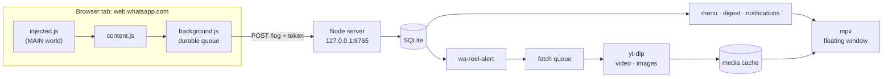

# wa-notify

**A personal WhatsApp Web archiver with an Instagram-reel pipeline: captured messages go into SQLite, reels and photo posts shared in chat open in a clean floating player.**

[](https://github.com/omsingh02/wa-notify/actions/workflows/ci.yml)
[](LICENSE)


> ## ⚠️ Hobby project — read this first
>
> * **Hobby project, single maintainer, no warranty, no support SLA.** It was built for **one person's Arch Linux + Hyprland desktop**. It is published as a reference, not as a product.
> * **Strictly platform-dependent** (Linux, Wayland, Hyprland window rules, mako, fuzzel, foot, systemd `--user`, a Chromium-based browser) and **full of hard-coded values**. See [docs/LIMITATIONS.md](docs/LIMITATIONS.md) for the complete list.
> * **Not affiliated with WhatsApp, Meta, Instagram or Google.** Hooking WhatsApp Web's internals is **against WhatsApp's Terms of Service**; downloading Instagram media with your own session may be against Instagram's. Your accounts could be restricted.
> * It stores **other people's messages** locally. Treat the database as sensitive personal data and respect the law and the people in your chats.
> * It breaks whenever WhatsApp Web, Instagram or yt-dlp change something. That is expected.

Landing page: **https://wa-notify-beta.vercel.app** · Docs: [Architecture](docs/ARCHITECTURE.md) · [Configuration](docs/CONFIGURATION.md) · [Operations](docs/OPERATIONS.md) · [Limitations](docs/LIMITATIONS.md) · [Known issues](docs/KNOWN_ISSUES.md)

## What it does

1. **Capture** — a Manifest V3 extension hooks WhatsApp Web's internal `Msg` collection and relays every new message (bursts, quoted replies, link previews) to a local server.
2. **Archive** — a dependency-free Node server (`node:sqlite`, WAL) stores messages and extracts Instagram links into a deduplicated SQLite database. Freshness is computed once: live messages alert, history is archived silently.
3. **Reel pipeline** — a Python daemon turns new reel/post links into desktop notifications, prefetches the media politely (one request at a time, cool-downs, retries), optionally summarises videos with Gemini, and opens everything in a floating, pinned `mpv` window. The browser is only the last resort.



Details: [docs/ARCHITECTURE.md](docs/ARCHITECTURE.md).

## Features

* Durable capture queue: survives server downtime and service-worker restarts; idempotent inserts.
* Freshness filtering (|capture time − message time| < 120 s) so scrolling old chats never floods you with alerts.
* **Polite fetching**: single worker, 3–7 s pacing, growing cool-down when Instagram blocks, separate pauses for network trouble, backoff retries, per-reel cross-process lock.
* **Reels and photo posts** in the same floating window; carousels switch with `<` / `>`.
* Optional Instagram session re-using your browser's existing cookies (no login performed).
* Optional Gemini summaries (video downscaled to fit, model cascade).
* Fuzzel picker, fzf digest with live preview, desktop notifications with *Play / Copy link* actions, daily cache cleanup.

## Requirements

| Component | Requirement |
|---|---|
| OS / session | Linux, Wayland (developed on Arch + Hyprland), `systemd --user` |
| Browser | Chromium-based, version ≥ 111 (MV3 MAIN-world content scripts) |
| Server | Node.js ≥ 22.13 (`node:sqlite` without a flag; prints an `ExperimentalWarning`) |
| Tools | Python ≥ 3.11 |
| Media | `yt-dlp`, `ffmpeg`, `mpv` |
| Desktop | `fuzzel`, `fzf`, `foot`/`footclient`, `wl-clipboard`, `notify-send` (libnotify) + a mako-style daemon |
| Optional | `python-rich` (pretty digest), `nmcli` + `ping` (metered / slow-Wi-Fi check before prefetching), `python-secretstorage` (read Chromium cookies from gnome-keyring), a Gemini API key (summaries) |

## Quick start

> Worked example for the author's machine; adapt paths. Step-by-step with upgrade/rollback: [docs/OPERATIONS.md](docs/OPERATIONS.md).

```bash
# 1. dependencies (Arch)
sudo pacman -S nodejs yt-dlp ffmpeg mpv fuzzel fzf foot wl-clipboard libnotify mako python-rich

# 2. get the code
git clone https://github.com/omsingh02/wa-notify.git && cd wa-notify

# 3. server (foreground, to try it)
node local-server/server.js            # prints the port, DB path and pairing state

# 4. extension: chrome://extensions → Developer mode → Load unpacked → extension/
#    open https://web.whatsapp.com and look for "[wa-notify] message store located" in devtools

# 5. tools on your PATH
ln -sf "$PWD/tools/wa-reel-alert.py"   ~/.local/bin/wa-reel-alert
ln -sf "$PWD/tools/wa-reel-menu.py"    ~/.local/bin/wa-reel-menu
ln -sf "$PWD/tools/wa-reel-digest.py"  ~/.local/bin/wa-reel-digest
ln -sf "$PWD/tools/wa-reel-cleanup.py" ~/.local/bin/wa-reel-cleanup

# 6. run as services (edit WorkingDirectory in the server unit first)
cp deploy/systemd/* ~/.config/systemd/user/
systemctl --user daemon-reload
systemctl --user enable --now wa-notify-server wa-reel-alert wa-reel-cleanup.timer
```

Then add the window rules and keybinding from `deploy/hyprland/` and, optionally, the mako section from `deploy/mako/`.
Optional: `~/.config/wa-notify/config.toml` ([docs/CONFIGURATION.md](docs/CONFIGURATION.md)) and `GEMINI_API_KEY_REELS` in `~/.config/.secrets` for summaries.

The first request from the extension **pairs** it with the server (trust on first use, token in `~/.config/wa-notify/token.txt`).

## Usage

| What | How |
|---|---|
| Pick an unopened reel | `wa-reel-menu` (bind it to a key): fuzzel list with sender, age, summary; *Mark all as opened*, history, digest |
| Browse with summaries | `wa-reel-digest` (fzf; Enter play, Ctrl-O browser, Ctrl-Y copy, Ctrl-D download, Ctrl-W layout); `-f` opens a floating terminal, `-t` prints a table |
| Live alerts | `wa-reel-alert` (the service). Notification actions: *Play in MPV*, *Copy link*. `--autoplay` opens the player immediately |
| One reel from the CLI | `tools/wa_reel_dl.py <shortcode\|url> [--summary]`, `tools/wa_reel_ai.py <id> --force` |
| Housekeeping | `wa-reel-cleanup [--days N] [--dry-run]` (daily timer) |

Clicking something that is not cached yet shows a *Fetching reel…* notification (only if it takes more than 2 s) and opens the player when the download finishes.

### Photo posts and carousels

yt-dlp cannot download image-only Instagram posts, so after the video attempt reports "no video", `wa_reel_dl` asks yt-dlp for the post's metadata, takes the largest image of every item and saves them as `<id>_1.jpg`, `<id>_2.jpg`, … (the file suffix follows the image's content type: `.jpg`, `.webp` or `.png`). They open in the same window as an image slideshow (`<` / `>`). Mixed carousels (video + photos) show only the video.

### Instagram session (optional)

Anonymous access is rate-limited and eventually redirected to Instagram's login page. With `[instagram]` configured, yt-dlp uses the Instagram cookies **your browser already has**:

* nothing logs in, no password is handled; only `instagram.com` cookies are copied to `~/.config/wa-notify/instagram-cookies.txt` (`0600`) and refreshed every few hours;
* Chromium encrypts cookies with a keyring key, so reading them needs `python-secretstorage` (restart `wa-reel-alert` after installing it);
* **the risk is yours**: automated logged-in requests can get an account challenged or rate-limited. wa-notify keeps volume low (one request at a time, cool-downs) but cannot promise anything. Prefer a secondary account/profile if you have one;
* check it with `python3 tools/wa_reel_auth.py --check` (never prints cookie values). Delete the config section to go back to anonymous mode.

## Troubleshooting

| Symptom | What to try |
|---|---|
| Nothing is captured | Open the WhatsApp tab's devtools. No `[wa-notify] message store located` after ~2 min → WhatsApp renamed its internal modules. Run `window.__waNotifyDebug()` (lists candidate modules) and `window.__waNotifyAttach(…)`; adjust `WELL_KNOWN_MODULES` in `extension/src/injected.js`; reload the extension |
| Reels open in the browser | `journalctl --user -u wa-reel-alert -f`: *blocking downloads* = Instagram rate limit (the queue retries by itself; configure `[instagram]` for reliability). *Can't reach Instagram* = DNS/network |
| Long stalls, `Resolving timed out` | your resolver is flapping (`journalctl -u systemd-resolved`, `resolvectl query www.instagram.com`); not a wa-notify bug |
| Extension queue grows, server answers `401` | token mismatch after reinstalling: delete `~/.config/wa-notify/token.txt`, reload the extension |
| `database is locked` | transient while another process writes; the server waits the busy timeout (5 s by default) and answers `500` so the extension keeps the batch |
| No summaries | set `GEMINI_API_KEY_REELS` (environment or `~/.config/.secrets`). Without a key the alert log says `No GEMINI_API_KEY_REELS found …`; after quota errors a reel can stay `pending` |

More: [docs/OPERATIONS.md](docs/OPERATIONS.md).

## Privacy and security model

* The server binds to **127.0.0.1 only**; the extension and server share a random token (trust on first use). CORS is defence in depth. Details and the hardening list: [docs/ARCHITECTURE.md](docs/ARCHITECTURE.md#4-security-model).
* The database and the optional JSONL backup contain **message bodies, JIDs/phone numbers, timestamps, link previews and WhatsApp media keys** (`raw_json`). They are plain files readable by your user. Encrypt backups; keep them out of cloud sync.
* Summaries upload the *video* to Google's Gemini API (never chat text). Downloads go to Instagram's CDN directly from your machine.
* Found a vulnerability? See [SECURITY.md](SECURITY.md).

## Platform dependence and hard-coded values

This repository is **not portable by design**. Highlights (full tables with file names and porting notes in [docs/LIMITATIONS.md](docs/LIMITATIONS.md)):

* Linux-only APIs (`fcntl`, `pkill`, `xdg-open`), Wayland-only tools (`wl-copy`, `fuzzel`, `mpv --wayland-app-id`), Hyprland-specific window rules, mako-style notification actions, `systemd --user`, gnome-keyring + a Brave profile path for cookies.
* The extension is Chromium-only and relies on **WhatsApp Web's private module names**; any WhatsApp deploy can break capture.
* Hard-coded: the 120 s freshness window, the Instagram URL regex, queue ladders and timeouts, retention days, the extension's default endpoint `127.0.0.1:8765` (overridable only through a `chrome.storage.local` key), many more. Some defaults are configurable (`config.toml [ui]` / `[ai]`, `WA_NOTIFY_*` env vars): window class `wa-reel` and size `420x750`, launcher, terminal, Gemini model names. Most values are not, and `deploy/hyprland/` repeats the window values, so change both.

Known bugs and what was fixed for the public release: [docs/KNOWN_ISSUES.md](docs/KNOWN_ISSUES.md).

## Project status and roadmap

Actively used by its author, not actively *maintained* for others. Plausible future work, no promises: adapters for X11/sway and macOS, an options page for the extension endpoint, schema migrations, summary retry sweep, per-sender filters, `/share/` Instagram URLs, packaging. Issues and small PRs are welcome but may sit unanswered — see [CONTRIBUTING.md](CONTRIBUTING.md).

## Development

```bash
pytest                      # Python tests (fake yt-dlp/mpv/notify-send, no network)
node --test "extension/test/*.test.js" "local-server/test/*.test.js"   # server and extension tests (quote the globs: Node 22 rejects directory arguments)
ruff check . && ruff format --check .                                   # CI enforces both
```

Conventional Commits, no SLA. Release notes: [CHANGELOG.md](CHANGELOG.md). Historical design documents: [docs/history/](docs/history/).

## License

[MIT](LICENSE) © 2026 Om Singh. Provided **as is**, without warranty of any kind.
