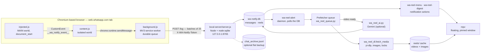
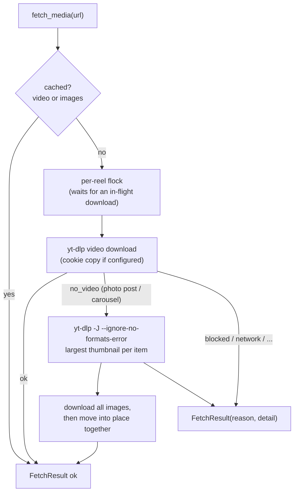

# Architecture

> **Hobby project.** Single maintainer, built for one person's Arch Linux / Hyprland desktop, no warranty.
> See [LIMITATIONS.md](LIMITATIONS.md) before assuming anything works elsewhere.

wa-notify has three jobs: **capture** WhatsApp Web messages, **archive** them in SQLite, and run an
Instagram **reel pipeline** (alert → fetch → summarise → play in a floating window).

## 1. Capture: why three hops

| Hop | Runs in | Why it exists |
|---|---|---|
| `extension/src/injected.js` | the page's own JS context (`"world": "MAIN"`, `document_start`) | Only code in the page context can reach WhatsApp's internal module registry. It wraps `window.__d` to see module registrations, resolves the message collection, and subscribes to `Msg.on('add')`. |
| `extension/src/content.js` | extension isolated world | Receives the page's `CustomEvent` and forwards it with `chrome.runtime.sendMessage`. The page world cannot call extension APIs. |
| `extension/src/background.js` | MV3 service worker | The only part exempt from the page's Content-Security-Policy, so it is the only part that may `fetch()` the local server. Keeps a durable queue in `chrome.storage.local` (`wa_notify_queue`, capped at 10 000 entries) so a stopped server or a restarted service worker loses nothing. |

A browser extension cannot write to an arbitrary path, so a small Node process owns the filesystem write.

## 2. Ingestion server (`local-server/server.js`)

* Plain Node `http` server bound to `127.0.0.1` (default port **8765**, `WA_NOTIFY_PORT`).
* Endpoints: `POST /log` (alias `POST /api/messages`) and `GET /health`.
* Storage: `node:sqlite` `DatabaseSync` in WAL mode, `synchronous = NORMAL`, and a `busy_timeout` of 5000 ms by default (`WA_NOTIFY_BUSY_TIMEOUT_MS`) that is set **before** `journal_mode`. If the database is locked at startup the server retries (20 × 250 ms) instead of exiting.
  Node (server) and Python (tools) both write to the same database; WAL plus the busy timeout is what makes that work. The server's DB calls are synchronous, so a long lock also stalls its event loop for up to the busy timeout.
* **Atomic batches**: each request is ingested in one `BEGIN IMMEDIATE … COMMIT` transaction. A database failure answers `500 {"error":"db_error"}` and the extension keeps the batch. Other answers: `200 {ok, count, inserted}`, `400` (bad JSON/payload, more than 500 entries), `401` (wrong token), `413` (body over 10 MB), `421` (foreign `Host`), `503` (token file unreadable).
* **Deduplication**: `INSERT OR IGNORE` keyed by WhatsApp message id (`messages.id`) and by Instagram shortcode (`reels.reel_id`).
  Re-delivery after a page reload or a retry is a no-op.
* **Freshness rule** (computed once, server-side): `is_likely_live = |captured_at/1000 − message_ts| < 120`.
  WhatsApp Web emits `add` for history it loads while you scroll, not only for new messages. Historical rows are archived and never alert.
  The comparison uses the extension's own `capturedAt`, not the server's receipt time, so a message queued while the server was down is still judged by when it arrived.
* **Reel extraction**: a regex over `body`, `caption` and the link-preview URL finds `instagram.com/(reel|reels|p)/<shortcode>` and inserts a `reels` row.
* Optional flat backup `chat_archive.jsonl` (`WA_NOTIFY_JSONL_BACKUP=1`, default on): newly inserted messages only.

### SQLite schema

Both `local-server/server.js` and `tools/walib.py` carry a copy of this DDL (see [KNOWN_ISSUES.md](KNOWN_ISSUES.md) — there are no migrations).

**`messages`**

| Column | Meaning | Unit / notes |
|---|---|---|
| `id` (PK) | WhatsApp serialized message id | text |
| `chat_id` | chat JID (`…@c.us`, `…@g.us`, `…@newsletter`, `…@lid`) | text |
| `sender` | display label chosen by `cleanSender()` (push name, `+number`, `You`, `Group`, …) | heuristic, not an id |
| `is_from_me` | message sent by the account owner | 0/1 |
| `message_ts` | WhatsApp's own timestamp | **seconds** |
| `captured_at` | when the extension saw it | **milliseconds** |
| `is_likely_live` | freshness rule above | 0/1 |
| `type`, `body`, `caption` | WhatsApp fields (for media messages `body` may be a base64 thumbnail) | text |
| `link_url`, `link_title` | link-preview metadata | text |
| `raw_json` | the whole captured entry (`convenience` + shallow `raw` attributes) | sensitive, see [SECURITY.md](../SECURITY.md) |

**`reels`**

| Column | Meaning | Unit / notes |
|---|---|---|
| `reel_id` (PK) | Instagram shortcode | first sighting wins (`INSERT OR IGNORE`) |
| `message_id`, `sender`, `chat_id`, `url`, `title` | provenance | |
| `timestamp` | message time | **seconds** |
| `first_seen_at` | capture time | **milliseconds** |
| `is_likely_live` | copied from the message | 0/1 |
| `is_downloaded`, `local_path` | media cached? first file | 0/1 |
| `is_opened`, `opened_at` | shown in the player/browser | 0/1, **seconds** |
| `alerted` | the alert daemon has handled the row | 0/1 |
| `summary`, `summary_status` | Gemini summary | `pending` / `done` |

Indexes: `idx_reels_unopened (is_opened, timestamp DESC)`, `idx_reels_alert (alerted, is_likely_live, first_seen_at)`, `idx_messages_ts (message_ts DESC)`.

## 3. Reel pipeline (Python, `tools/`)

### Alert daemon — `wa-reel-alert.py`

Polls `reels WHERE alerted = 0` every ~1.5 s. Live rows raise a desktop notification (actions: play / copy link)
and are handed to the fetch queue; historical rows are only marked `alerted = 1`.
Reels you sent yourself (`sender == 'You'`) are **not prefetched** (they still fetch on demand).
On start it re-queues up to 10 unopened live reels from the last 24 h that never got their media.

### Fetch queue — `wa_reel_queue.py`

One worker thread, so Instagram sees one request at a time:

| Behaviour | Value |
|---|---|
| Pause between fetches | random 3–7 s (`PACE`) |
| Order | newest first |
| `blocked` (login redirect / rate limit) | whole queue pauses 15 → 30 → 60 → 120 min (`COOLDOWNS`), strikes reset on success |
| `network` (DNS / connect / timeout) | queue pauses 1 → 2 → 5 → 10 min (`NET_PAUSES`); the reel keeps all its attempts |
| transient (`timeout`, `error`, `empty`, `no_formats`) | retry after 5 min, 20 min, 1 h, 3 h (`BACKOFF`), then give up |
| `unavailable` (private/removed) | one retry after 60 min |
| `no_video`, `no_ytdlp` | dropped, not retried |
| Age cap | reels older than 24 h are dropped (`MAX_AGE`) |

The queue only decides *when*; the fetch itself is in `wa_reel_dl.fetch_media`.

### Fetching — `wa_reel_dl.py`

* **Per-reel lock**: `fcntl.flock` on `$XDG_RUNTIME_DIR/wa-notify/locks/<id>.lock` (fallback `reels/.locks/`). Works across processes and threads, so a notification click during a prefetch *waits* instead of racing a second `yt-dlp` onto the same `.part` file.
* **`classify_error`** maps yt-dlp/curl/urllib text to reasons: `blocked`, `network`, `no_video`, `no_formats`, `empty`, `unavailable`, `timeout`, `no_ytdlp`, `error`.
* **Interactive fetches** (menu / notification) wait up to 100 s for a running download of the same reel (300 s for the queue) and retry **once** on a `network` failure.
* **Process group kill**: yt-dlp runs in its own session so a timeout also kills its `ffmpeg` children. Timed-out `.part` files are kept so the next attempt resumes.
* **Photo posts and carousels**: yt-dlp cannot download image-only posts even when logged in. `wa_reel_dl` asks yt-dlp for the post's metadata (`-J --ignore-no-formats-error`), whose `thumbnails` list contains the full-size image candidates, picks the largest per item, downloads them to `<id>_1.jpg|webp|png`, and publishes them atomically.

### Instagram session — `wa_reel_auth.py`

Optional. Nothing here logs in; it re-uses cookies the browser already holds.

* `config.toml [instagram]` names the browser/profile/keyring. `yt_dlp.cookies.extract_cookies_from_browser` reads them.
* Only `instagram.com` cookies are written to `instagram-cookies.txt` (mode `0600`, atomic replace), refreshed every `refresh_hours` (default 6); a stale copy up to 7 days old is used if the browser cannot be read; failures back off 10 minutes.
* Every yt-dlp run gets a **private throw-away copy** (yt-dlp rewrites its `--cookies` file on exit; concurrent runs must not share one).
* On `blocked` with a session, the browser's cookies are re-read once and the fetch retried only if the stored session actually changed.
* yt-dlp keeps Chromium's native expiry (µs since 1601) in its jar; `describe()` normalises it for display only.

### Summaries — `wa_reel_ai.py`

Optional. Started by the alert daemon when the queue reports a downloaded *video* (at most two summaries at a time) or by `wa_reel_dl.py --summary` / `wa_reel_ai.py`. Sends the video, base64-inlined, to the Gemini REST API and tries the models of `[ai] models` in order (default `gemini-3.5-flash`, then `gemini-3.5-flash-lite`). Videos above `[ai] max_inline_mb` (18) are first downscaled to 720p and cut to `[ai] clip_seconds` (90) with `ffmpeg` in a private temp directory; smaller ones are sent as they are. Per model: at most two attempts, retrying only 429/503 (after `Retry-After`, capped at 10 s) and network errors; an empty or blocked 200 is logged with its `finishReason` and not retried. The text goes to `reels.summary` and `summaries/<id>.txt`.

### Playback — `walib.play_in_mpv`

1. Use cached media, otherwise `fetch_media(interactive=True)` (a "Fetching reel…" notification appears only if it takes > 2 s).
2. Mark the reel opened, `pkill` the previous floating window, then start `mpv` with class/title `[ui] app_id` (default `wa-reel`), `--no-border`, `--autofit=<[ui] player_size>` (default `420x750`); videos loop (`--loop-file=inf`), photo posts show images (`--image-display-duration=inf --loop-playlist=inf`, `<`/`>` to switch).
3. If nothing could be fetched, open the URL with `xdg-open` and send a notification saying *why*.

## 4. Security model

* The server binds to **loopback only** and holds no credentials of its own.
* **Pairing (trust on first use)**: the extension generates a random token and sends it as `X-WA-Notify-Token`. While `~/.config/wa-notify/token.txt` does not exist the server accepts the first token it sees and persists it (`0600`); afterwards the token must match.
  Re-pair by deleting `token.txt` and reloading the extension.
* **CORS** is defence in depth: allow-list of `https://web.whatsapp.com`, local `http://localhost|127.0.0.1|[::1]` origins, and the extension origin when `WA_NOTIFY_EXTENSION_ID` is set; no `Access-Control-Allow-Origin` header otherwise (never `*`). The extension's own `fetch` bypasses CORS via `host_permissions`.
* Hardening in 0.2.0, each covered by `local-server/test/server.test.js`: `Host` header allow-list on every request, answered `421` otherwise (DNS rebinding); fail-closed `503` on token-file read errors; constant-time token comparison (`crypto.timingSafeEqual`, no dedicated test); `500` instead of `200` when the database write fails ("a write-locked database answers 500 (not 200)…"); UTF-8-safe body decoding ("UTF-8 characters split across two TCP writes are stored intact"); `busy_timeout` set before `journal_mode` ("startup waits for a lock held by another process…"); payload validation (`400`); database and backup files `0600` ("owner-only").
* Not solved: an unpaired server accepts unauthenticated writes until the first token arrives; `/health` is unauthenticated; the archive itself is sensitive. See [KNOWN_ISSUES.md](KNOWN_ISSUES.md).

## 5. Failure handling at a glance

| Failure | Behaviour |
|---|---|
| Server down | extension queues up to 10 000 entries, retries on every new message and every minute (alarm) |
| Database locked | server waits `busy_timeout` (5 s by default); on failure responds `500` so nothing is dropped |
| Instagram blocks anonymous access | one request, then the queue pauses with a growing cool-down |
| DNS / network outage | queue pauses briefly, attempts are not consumed; a click retries once |
| Download times out | process group killed, `.part` kept, retried later with backoff |
| Nothing fetchable | browser opens, notification states the reason |
| WhatsApp renames its internal modules | capture stops silently after ~120 s of polling; use the debug helpers (see README) |

## 6. Design decisions and rejected alternatives

* **Three hops, not one** — forced by the page CSP, extension world separation and the filesystem restriction (above).
* **SQLite, not JSONL** — queryable, idempotent inserts, opened-state as a column, safe for a Node writer and a Python writer at once. JSONL stays only as an optional backup.
* **Server computes freshness** — one place, from `capturedAt`, instead of three scripts guessing.
* **Polling the DB, not pushing** — SQLite has no cross-process notification; a 1.5 s poll is simple and cheap.
* **yt-dlp for images too** — reusing yt-dlp's maintained Instagram API recipe (`-J --ignore-no-formats-error` → `thumbnails`) beats writing and maintaining a custom Instagram API client.
* **Cookies via yt-dlp's extractor** — no password handling, no custom crypto; only Instagram cookies are persisted.
* **Rejected**: scraping Instagram's `/embed/` page (JS shell, no media in the HTML); crawler-UA `og:` tags (login wall for blocked IPs); official Meta APIs (no personal-use endpoint for arbitrary reel files); embedding the video as WhatsApp link-preview thumbnails (140×140).
